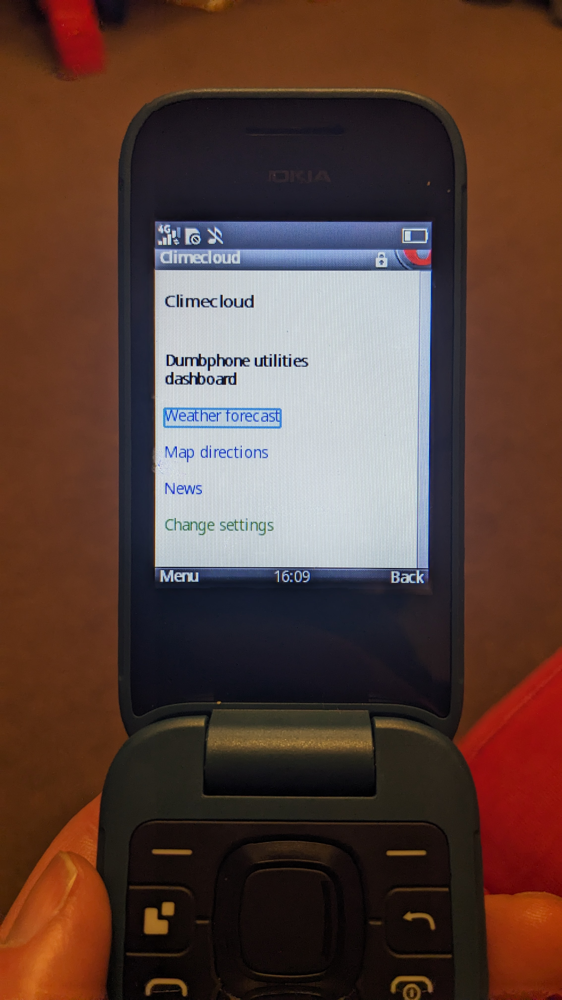
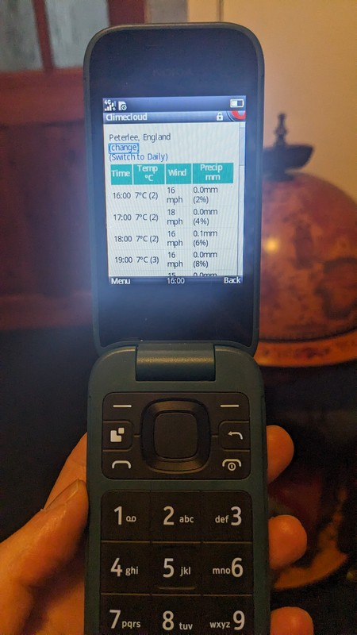
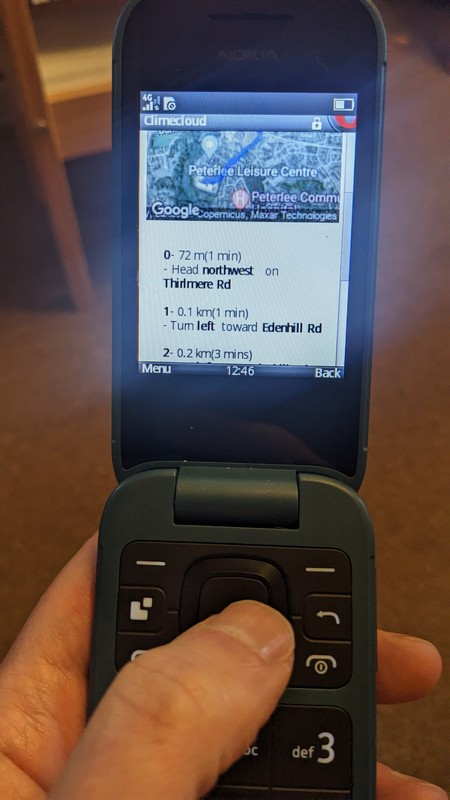

# README

<https://clime.cloud> is a web application designed to add convenient functionality to 4g feature phones (Also known as dumbphones) via a lightweight dashboard.

It is primarily tested through everyday use on my Nokia 2660.

All user information is stored client-side, meaning that there is no user data stored on climecloud servers.

Current functionality includes route navigation via maps, weather forecasting and news feeds.

This is all in a lightweight text-based format which is  sized to suit screens of 240x320px with minimal user interaction required due to the lack of touchscreen controls or a qwerty keyboard.

**Technologies used**

- Google maps
- <https://www.newscatcherapi.com/> (For your News feeds)
- <https://open-meteo.com> (For your Weather forecasting)
- <https://www.geoapify.com/> (To help determine your location)
- Ruby on rails

**Sample images**

