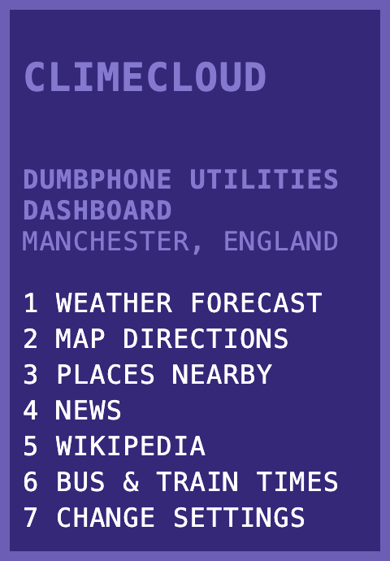
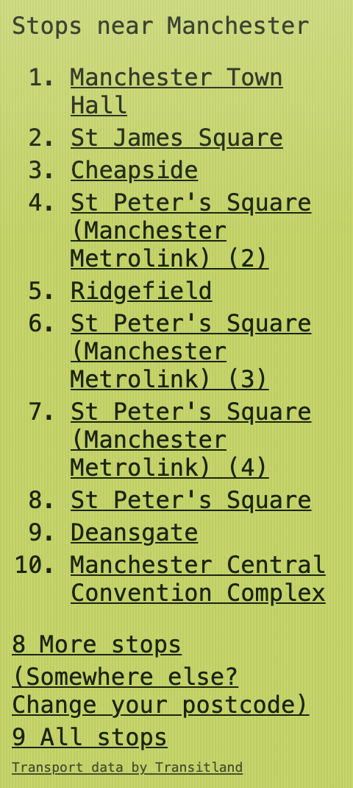
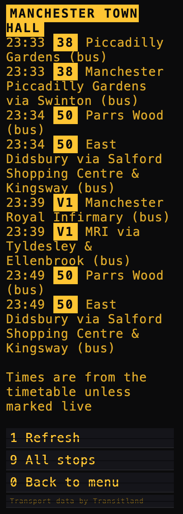
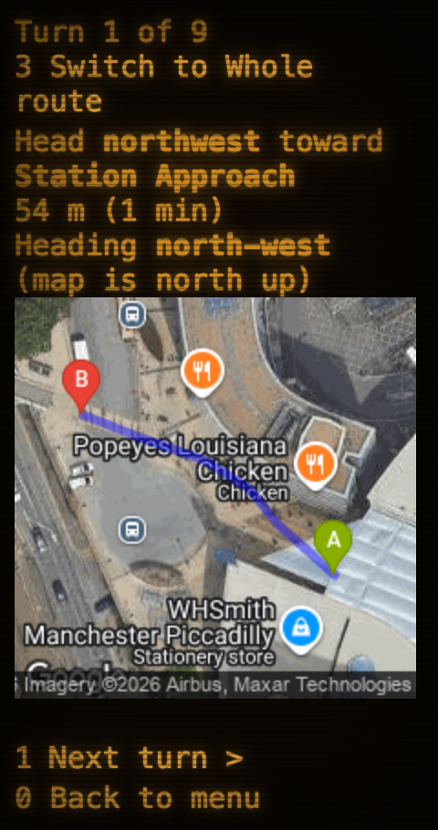
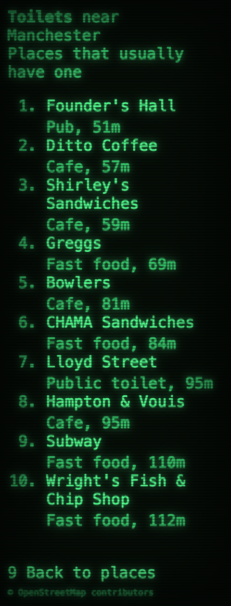
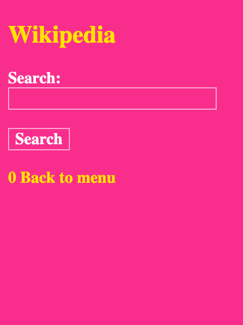
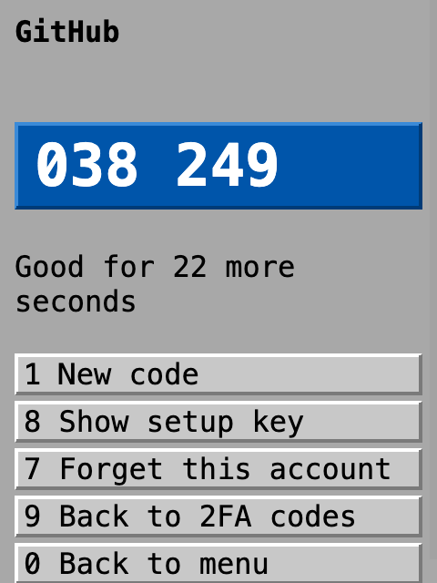
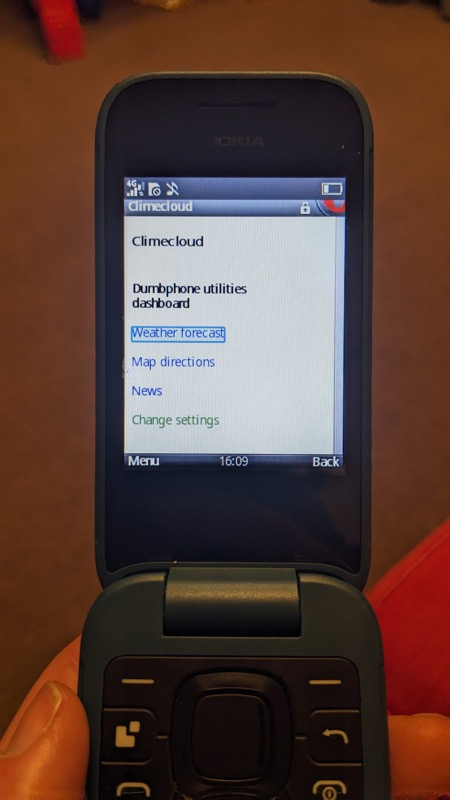
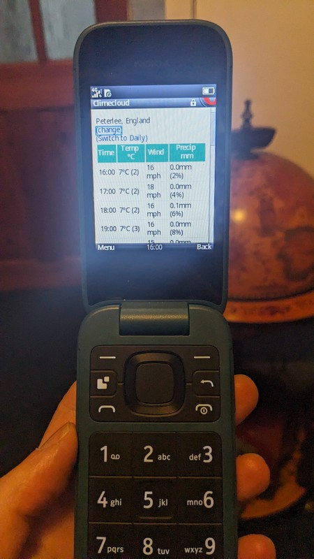
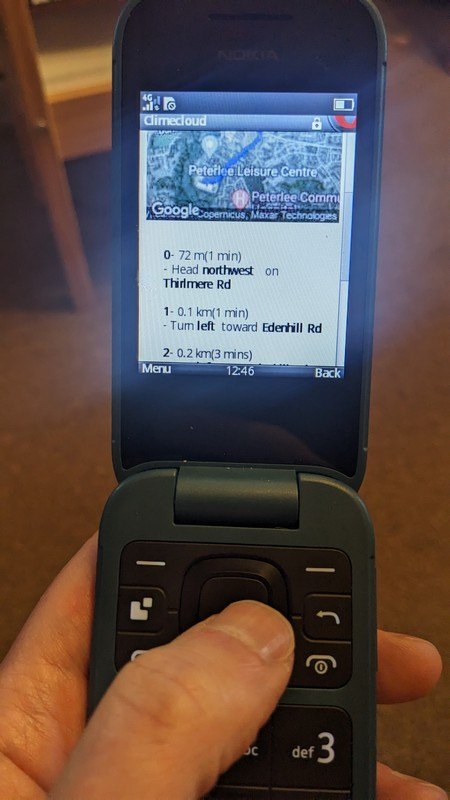

# README

<https://clime.cloud> is a web application designed to add convenient functionality to 4g feature phones (Also known as dumbphones) via a lightweight dashboard.

It is primarily tested through everyday use on my Nokia 2660.

All user information is stored client-side, meaning that there is no user data stored on climecloud servers.

Current functionality includes bus and train departures, turn by turn walking and driving directions, places nearby, weather forecasting, two-factor authentication codes, Wikipedia and news feeds.

This is all in a lightweight text-based format which is  sized to suit screens of 240x320px with minimal user interaction required due to the lack of touchscreen controls or a qwerty keyboard. There is no JavaScript on any page: every screen is plain HTML with a short numbered list of options on it. Browsers that support access keys can jump straight to one by its number.

**The dashboard**

*The main menu. Each option keeps its own number wherever it lands in the list, so places nearby is always 3 and departures is always 6. Theme: Commodore callback.*

**Bus and train times, without typing anything**

Typing a stop name on a keypad is miserable, so you never have to. The app takes the postcode saved in settings and lists the stops and stations around it in order of distance. Choose one and it is saved. It then shows up on the departures screen, two selections from the main menu.

*Every stop and station within walking distance, nearest first, with more a keypress away. Nothing here needs a keyboard. Theme: Nokia LCD.*

*A saved stop, with the time, the service number, where it is going and what kind of vehicle it is. Live times are marked as live; everything else is the timetable. Theme: Departure board.*

**Turn by turn navigation**

A route is broken into one turn per screen, each with its own map image, the distance and time for that leg, and the compass heading to set off on. Every turn ends with the same two options in the same order, 1 for the next turn and 2 for the last one, so the phone can stay in a pocket between junctions.

*Turn 1 of 9 on a walking route, with the map oriented north up. Theme: Amber phosphor.*

**Places nearby, including a toilet when you need one**

Ten categories of useful things around you — food, shops, cash, toilets, pharmacy, pub, transport, parking, petrol, and hospital and doctor — each returning the nearest handful with the distance to them. Toilets deliberately returns everything that usually has one rather than only public conveniences, because with a toddler in tow the nearest pub, cafe or Greggs is the answer far more often than an actual public toilet is. Each result links straight into walking directions.

*Toilets near central Manchester: a pub at 51m, a cafe at 57m, and an actual public toilet at 95m. Theme: Green phosphor.*

**Wikipedia**

Search Wikipedia and read the summary of an article, or the whole thing, as plain text at a readable size.

*The search screen. Results come back as a numbered list. Theme: Barbiephone.*

**Two-factor codes**

The phone can be the authenticator. When a site offers 2FA it shows a setup key next to its QR code — type that in once with a name, and from then on the account sits on the 2FA screen with its current six digit code and how long the code has left. Saved keys can be shown again at any time for writing down.

*A saved account's code, good for another 22 seconds. Theme: Workbench.*

**Themes**

The look is chosen in settings and remembered. The styles copy old screens: phosphor terminals, LCDs, Teletext, a departure board, a Game Boy. All of them work on the handset, though the ones built on a glow or on scanlines come out plainer there than on a modern phone.

* (No theme) — black on white, the default
* Amber phosphor
* Barbiephone
* Barbiephone dark
* Blue LCD
* Commodore callback
* Departure board
* E-ink paper
* Game Boy
* Green phosphor
* Nokia LCD
* OLED dark
* Orange plasma
* Teletext
* Workbench

**On the handset**

